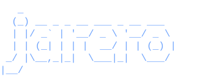

<div align="center">



<a href="https://git.io/typing-svg"></a>

<br>

[](https://linkedin.com/in/luis-carlos-jarero-martínez-195855337)
[](mailto:jareroluis@gmail.com)


</div>

---

Senior Software Engineer — **5+ years** shipping fintech products across **8 LATAM countries**. I build developer tools, MCP servers, and CLI scaffolders. Clean Architecture obsessed. I use AI to code and I ship fast.

---

### What I Ship

<table>
<tr>
  <td width="50%">
    <h3 align="center">claude-skills</h3>
    <div align="center">
      <p>CLI package manager for Claude Code skills & MCP servers</p>
      <a href="https://github.com/jarero321/portafolio/tree/main/claude-skills">
        
      </a>
      <a href="https://www.npmjs.com/package/@cjarero183006/claude-skills">
        
      </a>
      <br><br>
      
    </div>
  </td>
  <td width="50%">
    <h3 align="center">create-clean-app</h3>
    <div align="center">
      <p>Scaffold Clean Architecture projects — MCP servers & microservices</p>
      <a href="https://github.com/jarero321/portafolio/tree/main/create-clean-app">
        
      </a>
      <a href="https://www.npmjs.com/package/@cjarero183006/create-clean-app">
        
      </a>
      <br><br>
      
    </div>
  </td>
</tr>
<tr>
  <td width="50%">
    <h3 align="center">mcp-repo-monitor</h3>
    <div align="center">
      <p>MCP server for GitHub monitoring — PRs, CI status, rollbacks, drift detection</p>
      <a href="https://github.com/jarero321/portafolio/tree/main/mcp-repo-monitor">
        
      </a>
      <br><br>
      
    </div>
  </td>
  <td width="50%">
    <h3 align="center">mcp-obsidian-planner</h3>
    <div align="center">
      <p>17 MCP tools for Obsidian vault GTD planning</p>
      <a href="https://github.com/jarero321/portafolio/tree/main/mcp-obsidian-planner">
        
      </a>
      <br><br>
      
    </div>
  </td>
</tr>
</table>

```bash
npx @cjarero183006/claude-skills      # Manage Claude Code skills
npx @cjarero183006/create-clean-app   # Scaffold new projects
```

---

### Tech Stack

<div align="center">

**Languages & Frameworks**


**Infrastructure & Testing**


</div>

---

### Experience

**PayCash** — Senior Fullstack Developer *(2025 - Present)*
- Ownership of billing module scaled to 8 LATAM countries
- Solved critical connection pooling blocking production scaling
- Circuit breakers, internal packages, reference architecture

**Kuspit Casa de Bolsa** — Frontend Lead *(2024)*
- Led migration of payments platform and digital wallet
- Clean Architecture, Playwright E2E, CI/CD pipelines

**DD360** — Frontend Developer *(2022-2023)*
- Core features in microservices architecture
- TDD, integration testing for KYC services
- Team of 15+ with ex-CTO of Rappi LATAM

---

### Looking For

**Founding engineer** roles focused on developer tools, APIs, AI agents, and messaging platforms.

I ship fast, own features end-to-end, and thrive in high-autonomy environments where results matter more than process.

---

<div align="center">

**Let's build something cool.**

</div>


